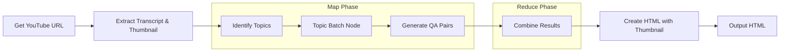

# YouTube Video Summarizer Design

## 1. Requirements

This project will create a system to summarize YouTube videos:

- **Input**: A YouTube video URL
- **Output**: An HTML page with:
  - Video thumbnail and link to original video
  - Key topics from the video
  - Summary of each topic
  - Questions and answers related to each topic
  - A friendly, accessible presentation

### Enhanced Features
- **Multilingual Support**: Support for both English and Vietnamese videos with language detection
- **Rich Visuals**: Integration of video thumbnails for improved user experience
- **Error Resilience**: Robust fallback mechanisms for transcript retrieval

### User-Centric Problem
Users struggle with quickly understanding the content of long videos without watching them entirely. This system will allow users to:
- Get the gist of a video without watching it
- Focus on specific sections that interest them
- Review key points and questions to test understanding
- Visually identify videos with the embedded thumbnail

### Complexity vs. Impact Balance
Initial focus will be on extracting key topics and generating simple Q&A pairs, with potential future enhancements for timestamps, visuals, and interactive elements.

## 2. Flow Design

We'll use a **MapReduce** design pattern for efficient processing of multiple topics. This pattern is ideal for our use case because:
- Each topic can be processed independently (Map phase)
- Results can be combined into a single output (Reduce phase)
- Processing can be parallelized in future implementations



Each node in the flow handles a specific step:
1. **Get YouTube URL**: Accept a YouTube URL from the user
2. **Extract Transcript & Thumbnail**: Get the video transcript using YouTube API with multilingual support, and fetch the video thumbnail
3. **Identify Topics**: Use LLM to identify key topics in the video
4. **Topic Batch Node**: Process each topic independently using BatchNode
5. **Generate QA Pairs**: Create questions and answers for each topic (executed once per topic)
6. **Combine Results**: Aggregate all topic results with their Q&A pairs
7. **Create HTML with Thumbnail**: Generate HTML visualization including the video thumbnail
8. **Output HTML**: Save the HTML file and notify the user

## 3. Utilities

We'll use these utility functions:

1. **YouTube Transcript Extraction**: `utils/youtube_utils.py`
   - Input: YouTube URL
   - Output: Text transcript, video ID, thumbnail URL
   - Necessity: Required to get content from YouTube
   - Features: Multilingual support (English, Vietnamese and fallback to any available language)

2. **LLM Wrapper**: `utils/llm_utils.py`
   - Input: Prompt string
   - Output: LLM-generated response
   - Necessity: Core component for all analysis and generation tasks

3. **HTML Generation**: `utils/html_utils.py`
   - Input: Topics data structure, video ID, thumbnail URL
   - Output: HTML string and file
   - Necessity: Required for creating the visual output
   - Features: Thumbnail integration, responsive design, visual styling

## 4. Node Design

### Shared Store Design
```python
shared = {
    "url": "",                   # YouTube URL provided by user
    "video_id": "",              # Extracted video ID
    "title": "",                 # Video title
    "thumbnail_url": "",         # URL to video thumbnail
    "transcript": "",            # Full video transcript
    "topics": [                  # List of extracted topics
        {
            "topic": "",         # Topic name
            "summary": "",       # Topic summary
            "questions": [       # List of Q&A pairs
                {
                    "question": "",
                    "answer": ""
                }
            ]
        }
    ],
    "processed_topics": [],      # Topics after batch processing
    "html": "",                  # Generated HTML
    "output_file": ""            # Path to output file
}
```

### Node Specifications

1. **GetYouTubeURL**
   - Type: Regular Node
   - Prep: None (initial node)
   - Exec: Get URL from user input
   - Post: Write URL to shared["url"]

2. **ExtractTranscriptNode**
   - Type: Regular Node
   - Prep: Read URL from shared["url"]
   - Exec: Call YouTube utils to extract transcript, video ID, and thumbnail URL
   - Post: Write transcript to shared["transcript"], ID to shared["video_id"], and thumbnail to shared["thumbnail_url"]

3. **IdentifyTopicsNode**
   - Type: Regular Node
   - Prep: Read transcript from shared["transcript"]
   - Exec: Call LLM to identify key topics and provide summaries
   - Post: Write topic structure to shared["topics"] (with empty questions)

4. **TopicBatchNode**
   - Type: BatchNode (Map phase)
   - Prep: Read topics from shared["topics"] and return as iterable
   - Exec: Called once per topic, passes the topic and transcript to GenerateQANode
   - Post: Collect results and store in shared["processed_topics"]

5. **GenerateQANode**
   - Type: Regular Node (Used within BatchNode)
   - Prep: Batch node provides topic and transcript
   - Exec: Generate questions and answers for a single topic
   - Post: Return the processed topic with questions

6. **CombineResultsNode**
   - Type: Regular Node (Reduce phase)
   - Prep: Read all processed topics from shared["processed_topics"]
   - Exec: Combine and organize all topics with their Q&A pairs
   - Post: Write final organized topics to shared["topics"]

7. **CreateHTMLNode**
   - Type: Regular Node
   - Prep: Read topics from shared["topics"], title, video_id, and thumbnail_url
   - Exec: Generate HTML using HTML utils, embedding the video thumbnail
   - Post: Write HTML to shared["html"] and save to file

## 5. Implementation

- **Keep it simple**: Focus on the core functionality first
- **Fail fast**: Ensure validation at each step and clear error messages
- **Logging**: Add logging to track progress and diagnose issues
- **Batch processing**: Process each topic independently for better organization and potential future parallelization
- **Multilingual support**: Use a cascading approach to try different languages and fall back as needed
- **Visual enhancement**: Include video thumbnails for better user engagement
